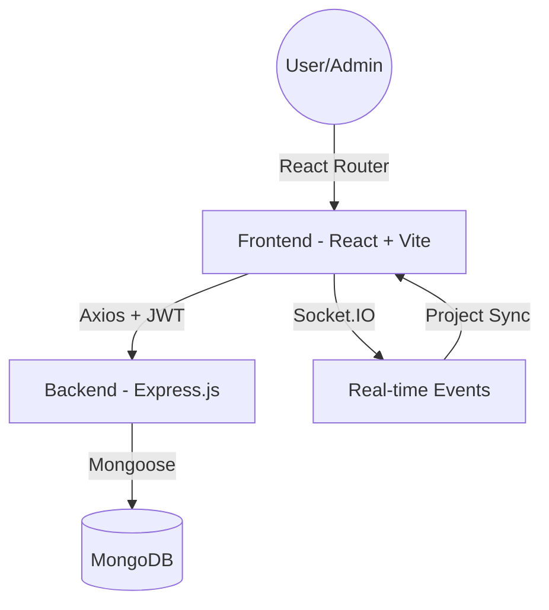
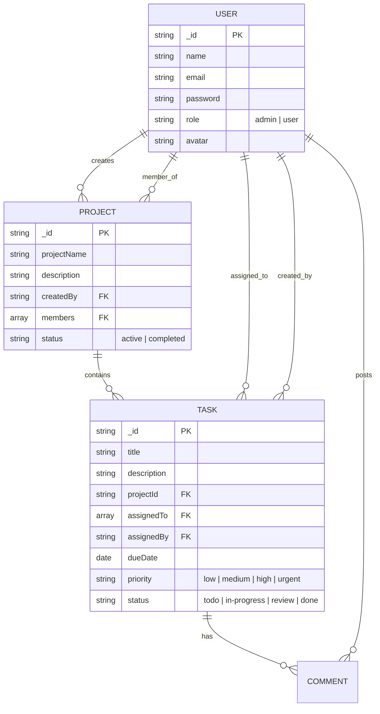

# 🏗️ TaskFlow System Architecture

## System Architecture

```mermaid
graph TD
    User((User/Admin)) -->|React Router| Frontend[Frontend - React + Vite]
    Frontend -->|Axios + JWT| API[Backend - Express.js]
    Frontend -->|Socket.IO| WS[Real-time Events]
    API -->|Mongoose| DB[(MongoDB)]
    WS -->|Project Sync| Frontend
```

## ER Diagram (Entity-Relationship)

```mermaid
erDiagram
    USER ||--o{ PROJECT : creates
    USER ||--o{ PROJECT : member_of
    PROJECT ||--o{ TASK : contains
    USER ||--o{ TASK : assigned_to
    USER ||--o{ TASK : created_by
    TASK ||--o{ COMMENT : has
    USER ||--o{ COMMENT : posts

    USER {
        string _id PK
        string name
        string email
        string password
        string role "admin | user"
        string avatar
    }

    PROJECT {
        string _id PK
        string projectName
        string description
        string createdBy FK
        array members FK
        string status "active | completed"
    }

    TASK {
        string _id PK
        string title
        string description
        string projectId FK
        array assignedTo FK
        string assignedBy FK
        date dueDate
        string priority "low | medium | high | urgent"
        string status "todo | in-progress | review | done"
    }
```
